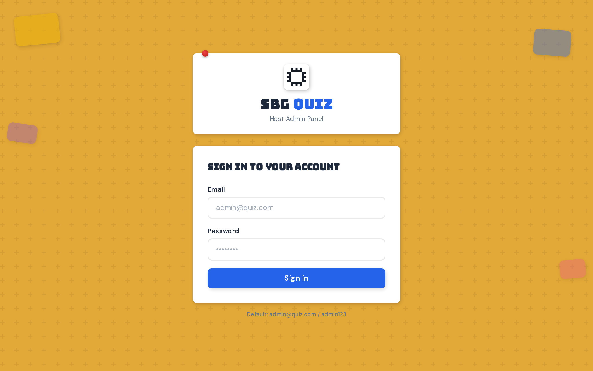
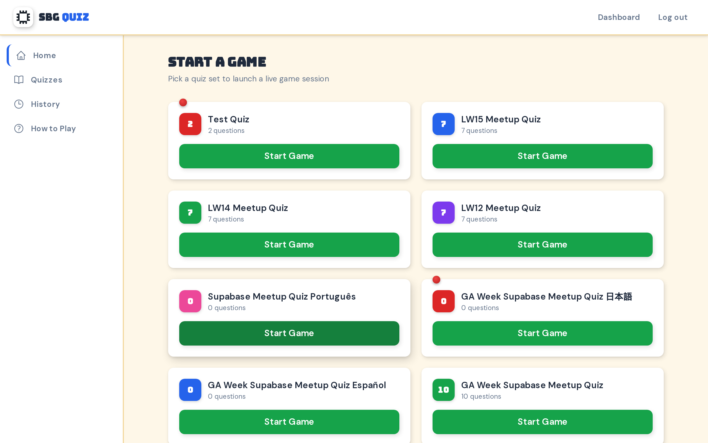
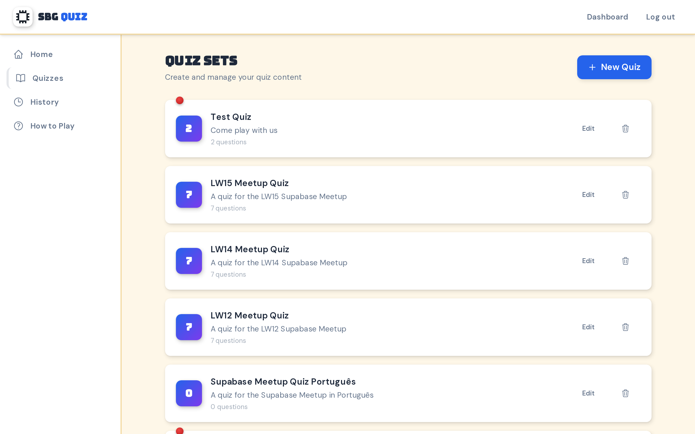

# SBG Quiz

Open-source Kahoot alternative for classrooms. Real-time quiz competitions with live leaderboards, animated podiums, and mobile-first player experience.

## Preview

<table>
  <tr>
    <td></td>
    <td></td>
  </tr>
  <tr>
    <td></td>
  </tr>
</table>


## Features

- **Host Dashboard** — Create quiz sets, launch game sessions, monitor participation
- **Live Quiz** — 20-second timed questions with 4 colored answer choices
- **Real-time Leaderboard** — Scores update between questions
- **Animated Podium** — 1st/2nd/3rd place reveal with confetti
- **Mobile Join** — Students join via QR code or 6-character room code
- **DiceBear Avatars** — Unique emoji avatars for each player
- **Game History** — Review past sessions with participant lists

## Tech Stack

- [Next.js 14](https://nextjs.org/) — App Router, React, TypeScript
- [Tailwind CSS](https://tailwindcss.com/) — Utility-first styling
- [Prisma](https://www.prisma.io/) — ORM
- [PostgreSQL](https://www.postgresql.org/) — Database
- [DiceBear](https://www.dicebear.com/) — Avatar generation

## Getting Started

```bash
# Install dependencies
npm install

# Set up database
npx prisma db push
npx prisma db seed

# Start dev server
npm run dev
```

Open [http://localhost:3000](http://localhost:3000)

| Route | Description |
|-------|-------------|
| `/` | Player join page |
| `/game/join` | Join with room code |
| `/host/login` | Host admin login |
| `/host/dashboard` | Quiz management |

**Default credentials:** `admin@quiz.com` / `admin123`

## Contributing

1. Fork the repository
2. Create feature branch (`git checkout -b feature/amazing-feature`)
3. Commit changes (`git commit -m 'Add amazing feature'`)
4. Push to branch (`git push origin feature/amazing-feature`)
5. Open Pull Request

## License

MIT © [AWS SBG Atria](https://github.com/AWSSBGAtria)
